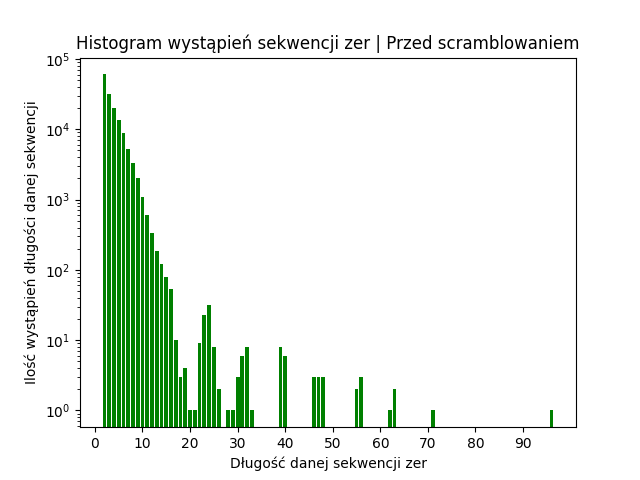
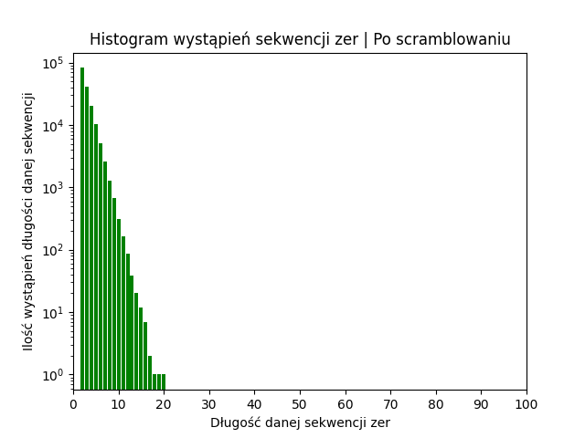

## Table of contents

- [Overview](#overview)
  - [The task](#the-task)
    - [Converting file to bits](#converting-file-to-bits)
    - [Additive method](#additive-method)
    - [Multiplicative method](#multiplicative-method)
  - [Preview](#preview)
- [Built with](#built-with)

## Overwiev

### The task

this is our college project for the subject <i>Niezawodność i Diagnostyka Układów Cyfrowych</i>

our task was to implement bits scrambler, working with both additive and multiplicative approach.

to generate pseudo-random keys, working with our methods, we decided to work on two scenarios:
  - generating random keys based on our application, each time new key is generated
  - generating keys based on shift register and polynomials, each time key is the same, well fitted to the length of original bit string

to make it even more real-word project, we decided to get bits from an .mp3 or .wav file, and then scramble them.

#### Converting file to bits

to convert raw .mp3 or .wav files we used ffmpeg package

#### Additive method

Additive method works...

(mamy juz wczesniej podany rejestr, robimy operacje xor, nastepnie aby odscramblowac znowu ta operacja jest wykonywana, jest to metoda synchroniczna - klucz sie nie zmienia nigdy)

#### Multiplicative method

Multiplicative method works...

(mamy juz wczesniej podany rejestr, natomiast ten rejestr oddzialuje z naszym ciagiem bitow ktory podajemy, wiec za kazdym razem jest inny, dla roznych ciągow bitow. tutaj jakis algorytm ktory tworzy nam ten klucz, np bierzemy bity co drugi i jakos laczymy z tym kluczem ktory byl w rejestrze. wowczas mamy ten klucz i teraz znowu wykonujemy operacje xor na tym kluczu i naszym ciagu bitow, aby dalo sie go odscramblowac, jest to metoda synchroniczna, klucz z rejestru wchodzi przez podany algorytm w nasz orginalny ciag bitow)

### Preview

working with our <i>wow.wav</i> file, which sounds like this and contains 1320848 single bits

[WOW.WAV FILE](https://github.com/user-attachments/assets/6fb41b60-7df4-4842-a213-708f7f6b4893)

the longest zero sequence here is 95bits

after we scrambled it, so that zero sequences should be smaller, to prevent desynchronization, it looks like this

now the longest sequence is only 20bits long

after scrambling our file should be encrypted, and so it sounds like that

(WARNING, LOUD NOISES)

[FILEAFTERSCRAMBLIG.WAV FILE](https://github.com/user-attachments/assets/86807408-4db8-4209-aae7-7f38468c97b6)

next we descramble our bits to get the actual data

[DESCRAMBLED FILE WITH NOISES](https://github.com/user-attachments/assets/39d291c8-b2c2-4a1c-b882-46503a251386)

as u can hear our file is mostly audible, but with small noise

thats because we simulated desynchronization probability, when our zero sequence is longer than selected value, in our case the probability with scrambler was 4%

to compare it here the file WITHOUT SCRAMBLER, where the whole desynchronization probability was 11%

[BEZSCRAMBLERA FILE](https://github.com/user-attachments/assets/1a8851a4-c21a-4ff3-b1b1-e5fb45eeb004)

of course if we didnt simulated any noise, our output file will be the same as the output

[CALUTKI FAJNY PLIK](https://github.com/user-attachments/assets/930ae02b-e00c-4e18-9962-13484d0021f3)

## Built with
to run this app, You will need to download ffmpeg

this may help You https://phoenixnap.com/kb/ffmpeg-windows
